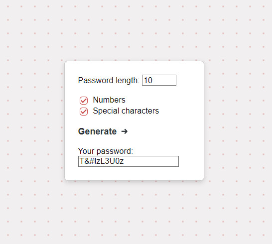

## 🔒️ Random Password Generator  

- [A simple application] (https://safepasswordgenerator.onrender.com) for generating random passwords.  
You can choose the password length and
include numbers and special characters  
(`@ # $ % & * ! ?`) to increase security
and randomness.
- Built with Java 17, Spring Boot, and Thymeleaf.
- Created to practice Spring Boot, unit testing, and integration testing.

### Tests

- Implemented unit tests using AssertJ.
- Implemented integration tests using MockMvc.
