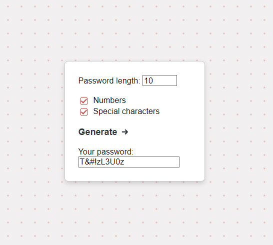

## 🔒️ Random Password Generator  


- [A simple web application for generating random passwords.](https://safe-password-generator-production.up.railway.app)  
You can choose the password length and
include numbers and special characters  
(`@ # $ % & * ! ?`) to increase security
and randomness.
- Built with Java 17, Spring Boot, and Thymeleaf.
- Created to practice Spring Boot, unit testing, and integration testing.



---

### 🚧 Tests

- Implemented unit tests for the
  password generation
  logic (`PasswordGeneratorUnitTests`)
  using AssertJ.
- Implemented integration tests (`PasswordsControllerIntegrationTest`)
  using MockMvc.

---

### 🚀 To run:

1. Run:
    ```bash
    ./mvnw spring-boot:run
    ```
